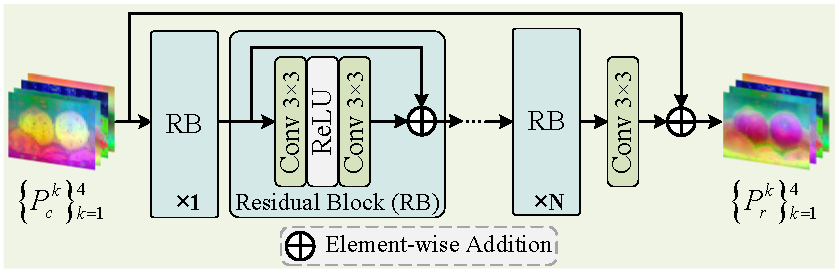
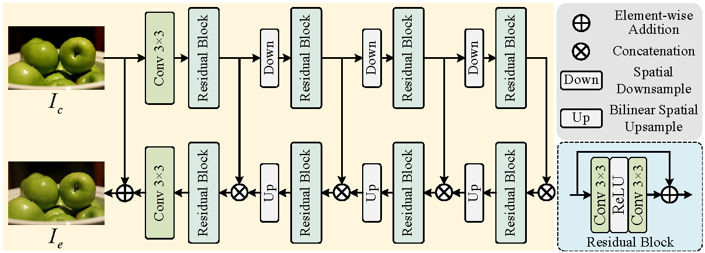

# HRPNet Supplementary Results

## 1. Object Detection under Unified Retraining

<!-- Source: Tables 1.10, 2.4, 3.1, and 4.8 in Response Letter-TCSVT-30733-20260930.docx. -->

Table 1. Object detection performance of methods retrained under unified settings on COCO2017 at different VVC QPs. AP, AP50, and AP75 (%) are reported. Higher values are better; the best result in each column is shown in **bold**.

<table>
  <thead>
    <tr>
      <th rowspan="2">Method</th>
      <th colspan="3">QP = 35</th>
      <th colspan="3">QP = 37</th>
      <th colspan="3">QP = 39</th>
      <th colspan="3">QP = 41</th>
    </tr>
    <tr>
      <th>AP</th>
      <th>AP50</th>
      <th>AP75</th>
      <th>AP</th>
      <th>AP50</th>
      <th>AP75</th>
      <th>AP</th>
      <th>AP50</th>
      <th>AP75</th>
      <th>AP</th>
      <th>AP50</th>
      <th>AP75</th>
    </tr>
  </thead>
  <tbody>
    <tr>
      <td>Compressed</td>
      <td align="center">34.83</td>
      <td align="center">53.57</td>
      <td align="center">37.35</td>
      <td align="center">32.73</td>
      <td align="center">51.00</td>
      <td align="center">35.06</td>
      <td align="center">30.09</td>
      <td align="center">47.37</td>
      <td align="center">31.69</td>
      <td align="center">26.93</td>
      <td align="center">42.82</td>
      <td align="center">28.43</td>
    </tr>
    <tr>
      <td>PromptCIR</td>
      <td align="center">36.72</td>
      <td align="center">56.09</td>
      <td align="center">39.65</td>
      <td align="center">35.72</td>
      <td align="center">55.13</td>
      <td align="center">38.20</td>
      <td align="center">34.04</td>
      <td align="center">53.04</td>
      <td align="center">36.21</td>
      <td align="center">31.63</td>
      <td align="center">49.81</td>
      <td align="center">33.55</td>
    </tr>
    <tr>
      <td>DAGN</td>
      <td align="center">34.97</td>
      <td align="center">53.78</td>
      <td align="center">37.38</td>
      <td align="center">32.89</td>
      <td align="center">51.30</td>
      <td align="center">35.21</td>
      <td align="center">30.20</td>
      <td align="center">47.35</td>
      <td align="center">31.85</td>
      <td align="center">27.19</td>
      <td align="center">43.21</td>
      <td align="center">28.59</td>
    </tr>
    <tr>
      <td>CODiff</td>
      <td align="center">31.07</td>
      <td align="center">47.61</td>
      <td align="center">33.22</td>
      <td align="center">30.08</td>
      <td align="center">46.49</td>
      <td align="center">31.68</td>
      <td align="center">28.85</td>
      <td align="center">44.74</td>
      <td align="center">30.92</td>
      <td align="center">27.00</td>
      <td align="center">42.15</td>
      <td align="center">28.57</td>
    </tr>
    <tr>
      <td>UniRestore</td>
      <td align="center">33.05</td>
      <td align="center">51.24</td>
      <td align="center">35.45</td>
      <td align="center">31.64</td>
      <td align="center">49.29</td>
      <td align="center">33.50</td>
      <td align="center">29.30</td>
      <td align="center">46.19</td>
      <td align="center">31.21</td>
      <td align="center">26.50</td>
      <td align="center">42.04</td>
      <td align="center">27.99</td>
    </tr>
    <tr>
      <td>EDTR</td>
      <td align="center">32.91</td>
      <td align="center">50.37</td>
      <td align="center">34.91</td>
      <td align="center">32.75</td>
      <td align="center">50.24</td>
      <td align="center">34.72</td>
      <td align="center">32.61</td>
      <td align="center">50.04</td>
      <td align="center">34.89</td>
      <td align="center">31.87</td>
      <td align="center">49.05</td>
      <td align="center">33.66</td>
    </tr>
    <tr>
      <td>Proposed</td>
      <td align="center"><strong>37.81</strong></td>
      <td align="center"><strong>57.62</strong></td>
      <td align="center"><strong>40.29</strong></td>
      <td align="center"><strong>36.33</strong></td>
      <td align="center"><strong>55.79</strong></td>
      <td align="center"><strong>38.52</strong></td>
      <td align="center"><strong>34.94</strong></td>
      <td align="center"><strong>54.07</strong></td>
      <td align="center"><strong>37.26</strong></td>
      <td align="center"><strong>32.46</strong></td>
      <td align="center"><strong>50.68</strong></td>
      <td align="center"><strong>34.41</strong></td>
    </tr>
  </tbody>
</table>

## 2. Instance Segmentation under Unified Retraining

<!-- Source: Tables 1.11, 2.5, 3.2, and 4.9 in Response Letter-TCSVT-30733-20260930.docx. -->

Table 2. Instance segmentation performance of methods retrained under unified settings on COCO2017 at different VVC QPs. AP, AP50, and AP75 (%) are reported. Higher values are better; the best result in each column is shown in **bold**.

<table>
  <thead>
    <tr>
      <th rowspan="2">Method</th>
      <th colspan="3">QP = 35</th>
      <th colspan="3">QP = 37</th>
      <th colspan="3">QP = 39</th>
      <th colspan="3">QP = 41</th>
    </tr>
    <tr>
      <th>AP</th>
      <th>AP50</th>
      <th>AP75</th>
      <th>AP</th>
      <th>AP50</th>
      <th>AP75</th>
      <th>AP</th>
      <th>AP50</th>
      <th>AP75</th>
      <th>AP</th>
      <th>AP50</th>
      <th>AP75</th>
    </tr>
  </thead>
  <tbody>
    <tr>
      <td>Compressed</td>
      <td align="center">31.96</td>
      <td align="center">51.45</td>
      <td align="center">33.85</td>
      <td align="center">30.11</td>
      <td align="center">48.69</td>
      <td align="center">31.91</td>
      <td align="center">27.69</td>
      <td align="center">45.42</td>
      <td align="center">28.96</td>
      <td align="center">24.40</td>
      <td align="center">40.77</td>
      <td align="center">25.11</td>
    </tr>
    <tr>
      <td>PromptCIR</td>
      <td align="center">33.55</td>
      <td align="center">53.76</td>
      <td align="center">35.47</td>
      <td align="center">32.75</td>
      <td align="center">52.93</td>
      <td align="center">34.39</td>
      <td align="center">31.11</td>
      <td align="center">50.71</td>
      <td align="center">32.70</td>
      <td align="center">28.50</td>
      <td align="center">47.16</td>
      <td align="center">29.69</td>
    </tr>
    <tr>
      <td>DAGN</td>
      <td align="center">31.91</td>
      <td align="center">51.37</td>
      <td align="center">33.83</td>
      <td align="center">30.08</td>
      <td align="center">48.84</td>
      <td align="center">31.78</td>
      <td align="center">27.69</td>
      <td align="center">45.46</td>
      <td align="center">28.92</td>
      <td align="center">24.68</td>
      <td align="center">41.19</td>
      <td align="center">25.49</td>
    </tr>
    <tr>
      <td>CODiff</td>
      <td align="center">28.33</td>
      <td align="center">45.51</td>
      <td align="center">29.69</td>
      <td align="center">27.39</td>
      <td align="center">44.19</td>
      <td align="center">28.76</td>
      <td align="center">26.18</td>
      <td align="center">42.56</td>
      <td align="center">27.37</td>
      <td align="center">24.37</td>
      <td align="center">40.10</td>
      <td align="center">25.34</td>
    </tr>
    <tr>
      <td>UniRestore</td>
      <td align="center">30.14</td>
      <td align="center">49.17</td>
      <td align="center">31.66</td>
      <td align="center">28.84</td>
      <td align="center">47.14</td>
      <td align="center">30.37</td>
      <td align="center">26.43</td>
      <td align="center">43.97</td>
      <td align="center">27.67</td>
      <td align="center">23.74</td>
      <td align="center">39.98</td>
      <td align="center">24.23</td>
    </tr>
    <tr>
      <td>EDTR</td>
      <td align="center">29.67</td>
      <td align="center">47.76</td>
      <td align="center">31.13</td>
      <td align="center">29.53</td>
      <td align="center">47.67</td>
      <td align="center">31.16</td>
      <td align="center">29.17</td>
      <td align="center">47.36</td>
      <td align="center">30.48</td>
      <td align="center">28.83</td>
      <td align="center">46.67</td>
      <td align="center">30.15</td>
    </tr>
    <tr>
      <td>Proposed</td>
      <td align="center"><strong>34.30</strong></td>
      <td align="center"><strong>55.10</strong></td>
      <td align="center"><strong>36.21</strong></td>
      <td align="center"><strong>33.20</strong></td>
      <td align="center"><strong>53.43</strong></td>
      <td align="center"><strong>34.89</strong></td>
      <td align="center"><strong>31.58</strong></td>
      <td align="center"><strong>51.52</strong></td>
      <td align="center"><strong>32.93</strong></td>
      <td align="center"><strong>29.21</strong></td>
      <td align="center"><strong>48.22</strong></td>
      <td align="center"><strong>30.38</strong></td>
    </tr>
  </tbody>
</table>

## 3. Generalization across Detection Networks

<!-- Source: Table 2.1 in Response Letter-TCSVT-30733-20260930.docx. -->

Table 3. Generalization performance across different detection networks on COCO2017 at QP = 39. AP, AP50, and AP75 (%) are reported for object detection. Higher values are better; the best result in each column is shown in **bold**.

<table>
  <thead>
    <tr>
      <th rowspan="2">Method</th>
      <th colspan="3">Faster R-CNN R50</th>
      <th colspan="3">RetinaNet R50</th>
      <th colspan="3">RetinaNet R101</th>
    </tr>
    <tr>
      <th>AP</th>
      <th>AP50</th>
      <th>AP75</th>
      <th>AP</th>
      <th>AP50</th>
      <th>AP75</th>
      <th>AP</th>
      <th>AP50</th>
      <th>AP75</th>
    </tr>
  </thead>
  <tbody>
    <tr>
      <td>Compressed</td>
      <td align="center">28.80</td>
      <td align="center">46.28</td>
      <td align="center">30.52</td>
      <td align="center">26.52</td>
      <td align="center">42.15</td>
      <td align="center">27.55</td>
      <td align="center">28.03</td>
      <td align="center">44.00</td>
      <td align="center">29.08</td>
    </tr>
    <tr>
      <td>PromptCIR</td>
      <td align="center">28.02</td>
      <td align="center">44.71</td>
      <td align="center">30.01</td>
      <td align="center">26.01</td>
      <td align="center">41.40</td>
      <td align="center">27.07</td>
      <td align="center">27.55</td>
      <td align="center">43.16</td>
      <td align="center">28.63</td>
    </tr>
    <tr>
      <td>DAGN</td>
      <td align="center">28.41</td>
      <td align="center">45.42</td>
      <td align="center">30.22</td>
      <td align="center">26.51</td>
      <td align="center">42.18</td>
      <td align="center">27.58</td>
      <td align="center">28.06</td>
      <td align="center">43.95</td>
      <td align="center">29.10</td>
    </tr>
    <tr>
      <td>CODiff</td>
      <td align="center">28.36</td>
      <td align="center">45.13</td>
      <td align="center">30.21</td>
      <td align="center">25.94</td>
      <td align="center">41.01</td>
      <td align="center">26.82</td>
      <td align="center">27.46</td>
      <td align="center">42.79</td>
      <td align="center">28.69</td>
    </tr>
    <tr>
      <td>UniRestore</td>
      <td align="center">27.31</td>
      <td align="center">43.72</td>
      <td align="center">28.89</td>
      <td align="center">25.35</td>
      <td align="center">40.30</td>
      <td align="center">26.32</td>
      <td align="center">27.01</td>
      <td align="center">42.57</td>
      <td align="center">28.03</td>
    </tr>
    <tr>
      <td>EDTR</td>
      <td align="center">30.71</td>
      <td align="center">48.04</td>
      <td align="center">32.23</td>
      <td align="center">29.76</td>
      <td align="center">46.26</td>
      <td align="center">30.98</td>
      <td align="center">30.66</td>
      <td align="center">47.43</td>
      <td align="center">31.93</td>
    </tr>
    <tr>
      <td>Proposed</td>
      <td align="center"><strong>33.44</strong></td>
      <td align="center"><strong>52.79</strong></td>
      <td align="center"><strong>35.25</strong></td>
      <td align="center"><strong>31.54</strong></td>
      <td align="center"><strong>49.18</strong></td>
      <td align="center"><strong>32.80</strong></td>
      <td align="center"><strong>33.03</strong></td>
      <td align="center"><strong>51.01</strong></td>
      <td align="center"><strong>34.44</strong></td>
    </tr>
  </tbody>
</table>

## 4. Generalization to Unseen VVC QPs

<!-- Source: Table 2.6 in Response Letter-TCSVT-30733-20260930.docx. -->

Table 4. Generalization performance on COCO2017 at unseen VVC QPs of 40, 42, 44, and 47. AP, AP50, and AP75 (%) are reported for object detection. Higher values are better; the best result in each column is shown in **bold**.

<table>
  <thead>
    <tr>
      <th rowspan="2">Method</th>
      <th colspan="3">QP = 40</th>
      <th colspan="3">QP = 42</th>
      <th colspan="3">QP = 44</th>
      <th colspan="3">QP = 47</th>
    </tr>
    <tr>
      <th>AP</th>
      <th>AP50</th>
      <th>AP75</th>
      <th>AP</th>
      <th>AP50</th>
      <th>AP75</th>
      <th>AP</th>
      <th>AP50</th>
      <th>AP75</th>
      <th>AP</th>
      <th>AP50</th>
      <th>AP75</th>
    </tr>
  </thead>
  <tbody>
    <tr>
      <td>Compressed</td>
      <td align="center">28.92</td>
      <td align="center">46.11</td>
      <td align="center">30.73</td>
      <td align="center">26.02</td>
      <td align="center">41.77</td>
      <td align="center">27.43</td>
      <td align="center">22.03</td>
      <td align="center">36.08</td>
      <td align="center">22.84</td>
      <td align="center">15.66</td>
      <td align="center">26.30</td>
      <td align="center">16.05</td>
    </tr>
    <tr>
      <td>PromptCIR</td>
      <td align="center">27.97</td>
      <td align="center">44.36</td>
      <td align="center">29.68</td>
      <td align="center">25.07</td>
      <td align="center">40.01</td>
      <td align="center">26.07</td>
      <td align="center">21.19</td>
      <td align="center">34.30</td>
      <td align="center">22.36</td>
      <td align="center">14.94</td>
      <td align="center">24.79</td>
      <td align="center">15.42</td>
    </tr>
    <tr>
      <td>DAGN</td>
      <td align="center">28.34</td>
      <td align="center">44.99</td>
      <td align="center">29.98</td>
      <td align="center">25.43</td>
      <td align="center">40.66</td>
      <td align="center">26.55</td>
      <td align="center">21.56</td>
      <td align="center">35.01</td>
      <td align="center">22.61</td>
      <td align="center">15.16</td>
      <td align="center">25.23</td>
      <td align="center">15.72</td>
    </tr>
    <tr>
      <td>CODiff</td>
      <td align="center">27.86</td>
      <td align="center">43.75</td>
      <td align="center">29.67</td>
      <td align="center">25.08</td>
      <td align="center">39.88</td>
      <td align="center">26.41</td>
      <td align="center">21.44</td>
      <td align="center">34.59</td>
      <td align="center">22.29</td>
      <td align="center">15.58</td>
      <td align="center">25.71</td>
      <td align="center">16.20</td>
    </tr>
    <tr>
      <td>UniRestore</td>
      <td align="center">27.64</td>
      <td align="center">43.80</td>
      <td align="center">29.09</td>
      <td align="center">24.72</td>
      <td align="center">39.76</td>
      <td align="center">25.99</td>
      <td align="center">21.24</td>
      <td align="center">34.65</td>
      <td align="center">22.37</td>
      <td align="center">15.02</td>
      <td align="center">25.16</td>
      <td align="center">15.39</td>
    </tr>
    <tr>
      <td>EDTR</td>
      <td align="center">31.43</td>
      <td align="center">48.52</td>
      <td align="center">33.17</td>
      <td align="center"><strong>31.22</strong></td>
      <td align="center">48.04</td>
      <td align="center"><strong>33.27</strong></td>
      <td align="center"><strong>30.52</strong></td>
      <td align="center"><strong>47.05</strong></td>
      <td align="center"><strong>32.31</strong></td>
      <td align="center"><strong>29.05</strong></td>
      <td align="center"><strong>45.02</strong></td>
      <td align="center"><strong>30.99</strong></td>
    </tr>
    <tr>
      <td>Proposed</td>
      <td align="center"><strong>33.46</strong></td>
      <td align="center"><strong>52.18</strong></td>
      <td align="center"><strong>35.25</strong></td>
      <td align="center">31.19</td>
      <td align="center"><strong>49.03</strong></td>
      <td align="center">33.09</td>
      <td align="center">27.83</td>
      <td align="center">44.44</td>
      <td align="center">29.17</td>
      <td align="center">21.17</td>
      <td align="center">34.82</td>
      <td align="center">21.73</td>
    </tr>
  </tbody>
</table>

## 5. Generalization to Hyperprior Compression

<!-- Source: Table 2.7 in Response Letter-TCSVT-30733-20260930.docx. -->

Table 5. Cross-codec generalization performance on COCO2017 images compressed by the Hyperprior model at quality levels 1, 2, and 3. AP, AP50, and AP75 (%) are reported for object detection. Higher values are better; the best result in each column is shown in **bold**.

<table>
  <thead>
    <tr>
      <th rowspan="2">Method</th>
      <th colspan="3">Quality = 1</th>
      <th colspan="3">Quality = 2</th>
      <th colspan="3">Quality = 3</th>
    </tr>
    <tr>
      <th>AP</th>
      <th>AP50</th>
      <th>AP75</th>
      <th>AP</th>
      <th>AP50</th>
      <th>AP75</th>
      <th>AP</th>
      <th>AP50</th>
      <th>AP75</th>
    </tr>
  </thead>
  <tbody>
    <tr>
      <td>Compressed</td>
      <td align="center">25.25</td>
      <td align="center">40.09</td>
      <td align="center">26.64</td>
      <td align="center">30.58</td>
      <td align="center">47.78</td>
      <td align="center">32.55</td>
      <td align="center">34.75</td>
      <td align="center">53.34</td>
      <td align="center">37.16</td>
    </tr>
    <tr>
      <td>PromptCIR</td>
      <td align="center">24.63</td>
      <td align="center">39.11</td>
      <td align="center">25.94</td>
      <td align="center">30.01</td>
      <td align="center">47.00</td>
      <td align="center">31.91</td>
      <td align="center">34.28</td>
      <td align="center">52.60</td>
      <td align="center">36.89</td>
    </tr>
    <tr>
      <td>DAGN</td>
      <td align="center">25.21</td>
      <td align="center">40.10</td>
      <td align="center">26.62</td>
      <td align="center">30.49</td>
      <td align="center">47.63</td>
      <td align="center">32.41</td>
      <td align="center">34.75</td>
      <td align="center">53.36</td>
      <td align="center">37.27</td>
    </tr>
    <tr>
      <td>CODiff</td>
      <td align="center">25.93</td>
      <td align="center">40.88</td>
      <td align="center">27.30</td>
      <td align="center">28.83</td>
      <td align="center">44.86</td>
      <td align="center">30.60</td>
      <td align="center">31.41</td>
      <td align="center">48.12</td>
      <td align="center">33.45</td>
    </tr>
    <tr>
      <td>UniRestore</td>
      <td align="center">24.48</td>
      <td align="center">39.27</td>
      <td align="center">25.42</td>
      <td align="center">28.50</td>
      <td align="center">44.89</td>
      <td align="center">30.47</td>
      <td align="center">32.16</td>
      <td align="center">50.03</td>
      <td align="center">34.23</td>
    </tr>
    <tr>
      <td>EDTR</td>
      <td align="center"><strong>31.87</strong></td>
      <td align="center"><strong>48.98</strong></td>
      <td align="center"><strong>33.88</strong></td>
      <td align="center">32.39</td>
      <td align="center">49.79</td>
      <td align="center">34.38</td>
      <td align="center">32.70</td>
      <td align="center">49.94</td>
      <td align="center">34.59</td>
    </tr>
    <tr>
      <td>Proposed</td>
      <td align="center">29.60</td>
      <td align="center">46.86</td>
      <td align="center">31.14</td>
      <td align="center"><strong>34.17</strong></td>
      <td align="center"><strong>52.87</strong></td>
      <td align="center"><strong>36.32</strong></td>
      <td align="center"><strong>37.04</strong></td>
      <td align="center"><strong>56.48</strong></td>
      <td align="center"><strong>39.68</strong></td>
    </tr>
  </tbody>
</table>

## 6. Network Architectures

<!-- Source: Figs. 1.1 and 4.2. -->

**Figure 1.** Architecture of the Residual Refinement Network (RRNet) used as a capacity-controlled alternative to LPRNet. RRNet-4 and RRNet-8 employ four and eight residual blocks at each prior level, respectively.

<!-- Source: Figs. 1.2 and 4.1. -->

**Figure 2.** Architecture of the Base model without semantic-prior guidance and SFSEM.
